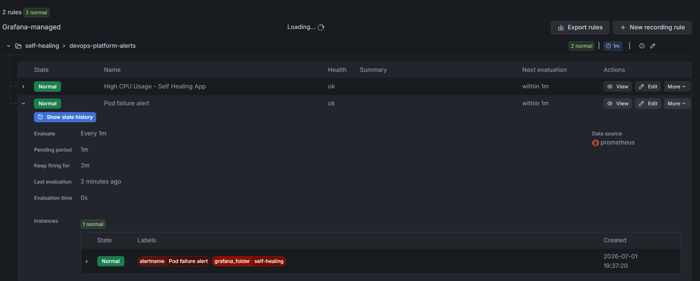
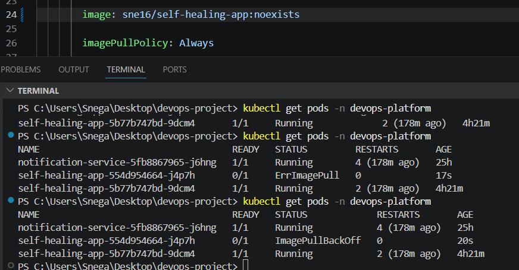
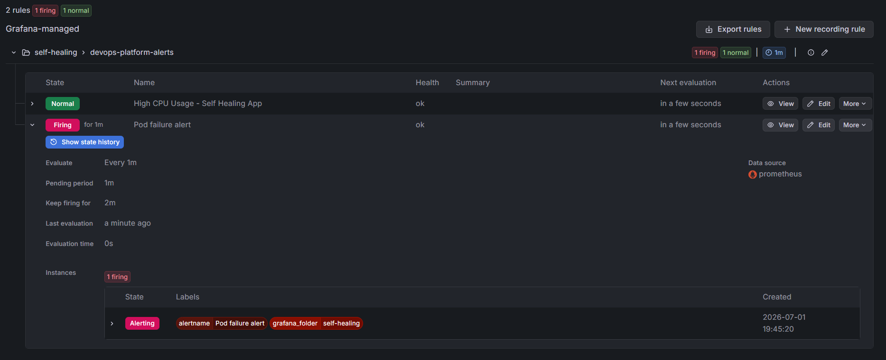
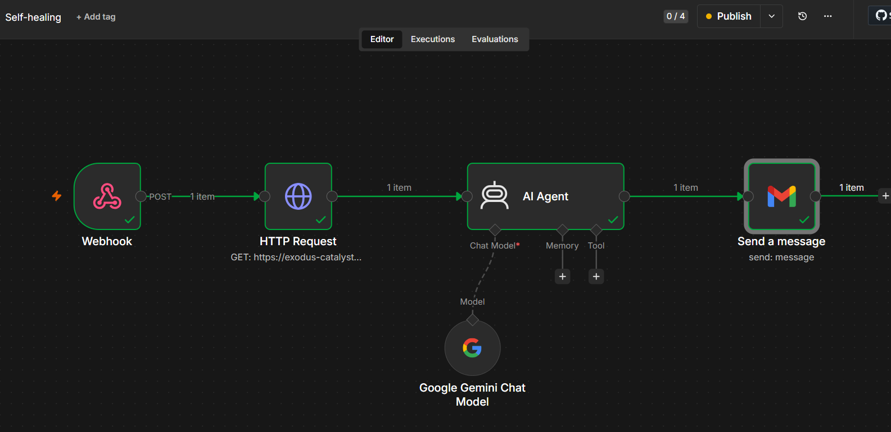
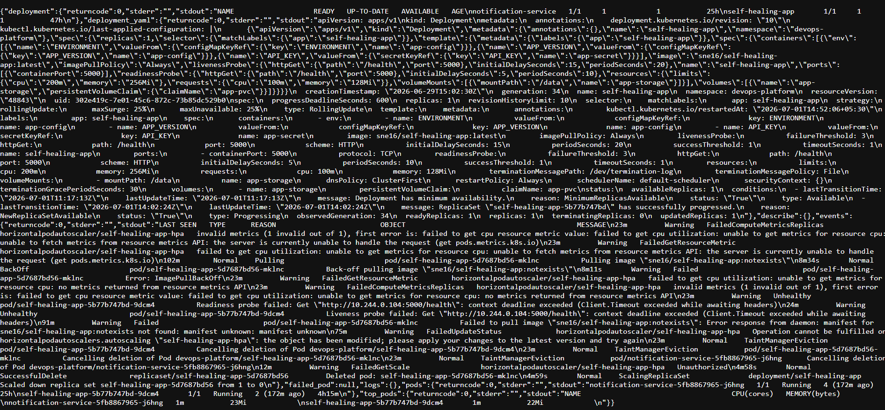
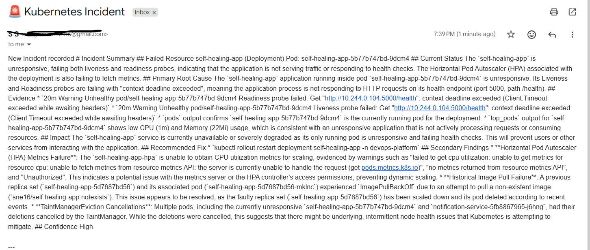
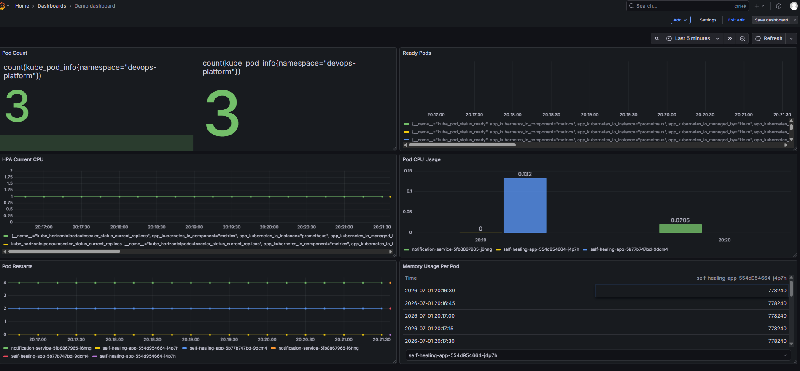

# Kubernetes AI Incident Detection & Auto-Healing System

## Overview

This project automates Kubernetes incident detection, root cause analysis (RCA), and reporting using Grafana, n8n, Python, and Google Gemini.

When a Kubernetes incident occurs (for example, ImagePullBackOff, CrashLoopBackOff, Pending Pods, or Container Creation failures), Grafana triggers an alert. The workflow automatically collects live Kubernetes evidence, analyzes the incident using AI, and generates a detailed incident report with remediation recommendations.

---

## Problem Statement

Troubleshooting Kubernetes incidents often requires engineers to manually inspect:

* Pod status
* Events
* Deployment configurations
* Logs
* Resource utilization

This process can be time-consuming during production incidents.

This project reduces investigation time by automatically gathering evidence and generating an AI-powered root cause analysis report.

---

# 🔧 What I Implemented

## ☸️ Kubernetes Setup & Deployments
- Set up **Minikube cluster**
- Created and managed:
  - Deployments
  - ReplicaSets
  - Services  
- Performed **rolling updates and debugging** using `kubectl`

---

## 🌐 Networking & Ingress
- Exposed applications using Kubernetes **Service (ClusterIP / NodePort)**
- Configured and tested **Ingress controller** for traffic routing
- Verified external access using **ngrok tunnel** for webhook testing

---

## 💾 Storage & Volumes
- Implemented **Persistent Volume (PV)** and **Persistent Volume Claim (PVC)**
- Mounted shared storage inside pods
- Tested **data persistence across pod restarts**

---

## ⚙️ Resource Management
- Defined **CPU and Memory requests & limits**
- Tested resource sharing behavior between pods
- Configured **Horizontal Pod Autoscaler (HPA)** based on CPU usage
- Observed **automatic scaling under load**

---

## ❤️ Health & Reliability
- Implemented:
  - Liveness probes
  - Readiness probes
- Simulated failures:
  - ImagePullBackOff
  - CrashLoopBackOff
  - Probe failures
- Debugged using:
  - `kubectl logs`
  - `kubectl describe`
  - `kubectl get events`

---

## 📊 Observability & Alerting

Built a Grafana dashboard to monitor Kubernetes cluster health in real time.

The dashboard includes:

- CPU usage per pod (resource utilization tracking)
- Memory usage per pod (stability monitoring)
- Pod restart count (CrashLoopBackOff / ImagePullBackOff detection)
- Deployment replica health (desired vs available state)
- HPA scaling behavior visibility

Configured alert rules for:
- Pod failures (CrashLoopBackOff, ImagePullBackOff)
- High CPU usage thresholds
- Deployment health degradation

Alerts are triggered via webhook and sent to n8n workflow for automated incident processing and AI-based root cause analysis.

---

## 🔁 Automation Flow (DevOps + AI)
- Alerts trigger **n8n workflow automatically**
- Collected cluster diagnostics:
  - Pods
  - Events
  - Logs
- Sent data to **AI agent for root cause analysis**
- Generated **automated incident reports**
  
## Architecture

# AI-Powered Kubernetes Incident Analyzer

```text
+-------------------+
| Kubernetes Cluster|
| (Pods, Deployments|
|  HPA, Services)   |
+---------+---------+
          |
          | Pod Failure
          | ImagePullBackOff
          | CrashLoopBackOff
          v
+-------------------+
| Grafana Alerting  |
| Alert Rules       |
+---------+---------+
          |
          | Webhook
          v
+-------------------+
| n8n Workflow      |
+---------+---------+
          |
          | Collect Data
          |
          +--------------------+
          |                    |
          v                    v
+----------------+    +----------------+
| kubectl get    |    | kubectl describe|
| pods/events    |    | logs/deployment |
+----------------+    +----------------+
          |
          | Consolidated Incident Data
          v
+-------------------+
| AI Analysis Agent |
| (Gemini/OpenAI)   |
+---------+---------+
          |
          | Root Cause Analysis
          | Impact Assessment
          | Recommended Fix
          v
+-------------------+
| Incident Report   |
| - Root Cause      |
| - Evidence        |
| - Impact          |
| - Fix             |
+---------+---------+
          |
          v
+-------------------+
| Email / Slack /   |
| Teams / Jira      |
+-------------------+
```

---

## Technology Stack

* Kubernetes
* Minikube
* Grafana
* n8n
* Python
* Flask
* Google Gemini
* Docker
* Kubernetes Metrics Server

---

## Features

### Incident Detection

Monitors and detects:

* ImagePullBackOff
* CrashLoopBackOff
* Error
* Pending Pods
* ContainerCreating Failures

### Automated Evidence Collection

The Python service automatically gathers:

* Pod status
* Kubernetes events
* Pod descriptions
* Deployment YAML
* Pod logs
* Resource utilization metrics

### AI-Powered Root Cause Analysis

Gemini analyzes collected evidence and provides:

* Incident summary
* Root cause
* Supporting evidence
* Business impact
* Recommended remediation
* Secondary findings
* Confidence level

### Automated Reporting

Incident reports are automatically delivered through email.

---

## Workflow

### Step 1: Kubernetes Failure Occurs

Example:

```text
self-healing-app-xxxx   0/1   ImagePullBackOff
```

---

### Step 2: Grafana Detects Failure

Grafana alert rule enters the Firing state.

---

### Step 3: n8n Workflow Triggered

The Grafana webhook triggers the n8n workflow.

---

### Step 4: Kubernetes Evidence Collection

The Flask API collects:

```bash
kubectl get pods
kubectl get events
kubectl describe pod
kubectl logs
kubectl get deployment -o yaml
kubectl top pods
```

---

### Step 5: AI Analysis

Gemini analyzes the evidence and generates an RCA report.

```text
New Incident recorded

# Incident Summary

## Failed Resource

self-healing-app (Deployment)
Pod: self-healing-app-5b77b747bd-9dcm4

## Current Status

The `self-healing-app` is unresponsive, failing both liveness and readiness probes, indicating that the application is not serving traffic or responding to health checks. The Horizontal Pod Autoscaler (HPA) associated with the deployment is also failing to fetch metrics.

## Primary Root Cause

The `self-healing-app` application running inside pod `self-healing-app-5b77b747bd-9dcm4` is unresponsive. Its Liveness and Readiness probes are failing with "context deadline exceeded", meaning the application process is not responding to HTTP requests on its health endpoint (port 5000, path /health).

## Evidence

*   `20m Warning Unhealthy pod/self-healing-app-5b77b747bd-9dcm4 Readiness probe failed: Get "http://10.244.0.104:5000/health": context deadline exceeded (Client.Timeout exceeded while awaiting headers)`
*   `20m Warning Unhealthy pod/self-healing-app-5b77b747bd-9dcm4 Liveness probe failed: Get "http://10.244.0.104:5000/health": context deadline exceeded (Client.Timeout exceeded while awaiting headers)`
*   `pods` output confirms `self-healing-app-5b77b747bd-9dcm4` is the currently running pod for the deployment.
*   `top_pods` output for `self-healing-app-5b77b747bd-9dcm4` shows low CPU (1m) and Memory (22Mi) usage, which is consistent with an unresponsive application that is not actively processing requests or consuming resources.

## Impact

The `self-healing-app` service is currently unavailable or severely degraded as its only running pod is unresponsive and failing health checks. This will prevent users or other services from interacting with the application.

## Recommended Fix

*   `kubectl rollout restart deployment self-healing-app -n devops-platform`

## Secondary Findings

*   **Horizontal Pod Autoscaler (HPA) Metrics Failure**: The `self-healing-app-hpa` is unable to obtain CPU utilization metrics for scaling, evidenced by warnings such as "failed to get cpu utilization: unable to get metrics for resource cpu: unable to fetch metrics from resource metrics API: the server is currently unable to handle the request (get pods.metrics.k8s.io)", "no metrics returned from resource metrics API", and "Unauthorized". This indicates a potential issue with the metrics server or the HPA controller's access permissions, preventing dynamic scaling.
*   **Historical Image Pull Failure**: A previous replica set (`self-healing-app-5d7687bd56`) and its associated pod (`self-healing-app-5d7687bd56-mklnc`) experienced `ImagePullBackOff` due to an attempt to pull a non-existent image (`sne16/self-healing-app:notexists`). This issue appears to be resolved, as the faulty replica set (`self-healing-app-5d7687bd56`) has been scaled down and its pod deleted according to recent events.
*   **TaintManagerEviction Cancellations**: Multiple pods, including the currently unresponsive `self-healing-app-5b77b747bd-9dcm4` and `notification-service-5fb8867965-j6hng`, had their deletions cancelled by the TaintManager. While the deletions were cancelled, this suggests that there might be underlying, intermittent node health issues that Kubernetes is attempting to mitigate.

## Confidence

High
```

---

### Step 6: Incident Report Delivery

The generated RCA report is automatically sent through email.

---

## Screenshots

### Normal Monitoring State



### Pod Failure



### Grafana Alert Fired



### n8n Workflow



### Flask API Response



### Email Incident Report



### Grafana Dashboard



## 📌 Key Metrics & Panels

### 🔹 Total Pods in Namespace

```promql
count(kube_pod_info{namespace="devops-platform"})

Shows the total number of pods running in the namespace.

---

## Sample Incident

### Incident

ImagePullBackOff caused by an invalid image tag.

### Root Cause

```text
sne16/self-healing-app:notexists
```

### Evidence

```text
Failed to pull image:
manifest unknown

Reason:
ImagePullBackOff
```

### Impact

* Deployment rollout blocked
* One replica unavailable
* Reduced application availability

### Fix

```bash
kubectl set image deployment/self-healing-app \
self-healing-app=sne16/self-healing-app:latest \
-n devops-platform
```

